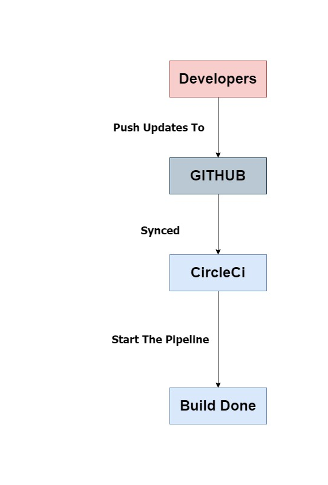

### Pipeline process

###### this pipeline have a very simple steps

1. It use circleCi version 2
2. Spin up env
3. Prepare env variables
4. Install node.js version 16.13
5. Install NPM
6. Checkout code
7. Install AWS CLI - latest
8. Configure AWS access key ID
9. Setting up EB CLI
10.   Front-End Install dependencies (Script)
11.   Back-End Install dependencies (Script)
12.   Back-End Build (Script)
13.   Back-End Build (Script)
14.   Front-End Deploy (Script)
15.   Back-End Deploy (Script)

